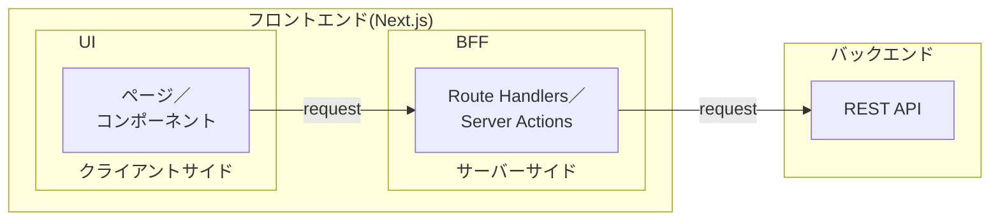

```mermaid
flowchart LR
	subgraph "フロントエンド(Next.js)"
		subgraph "UI<br><br><br><br><br>クライアントサイド"
			U["ページ／<br>コンポーネント"]
		end
		subgraph "BFF<br><br><br><br><br>サーバーサイド"
			B[Route Handlers／<br>Server Actions]
		end
	end
	U-- request -->B
	subgraph "バックエンド"
		REST["REST API"]
	end
	B-- request -->REST
```
